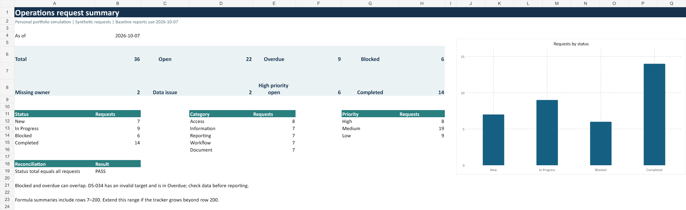
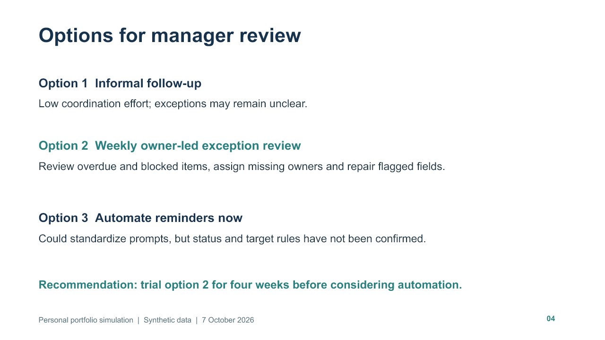

# Operations Request Tracker and Reporting

## Project overview

This is my personal portfolio simulation of a small operations request queue. It combines an editable Excel tracker with a short status report, a decision brief and a five-slide manager presentation. The 36 requests and role names are fictional practice data. This is a learning project, not client work or a deployed service system.

The image above and the [Requests sheet capture](screenshots/tracker-requests.png) come from the revised workbook, not a mockup.

## Business problem

Requests arriving through different channels can be hard to coordinate when the team records different details in different places. A manager needs to know what remains open, which targets have passed, where work is blocked and which records need correction before the figures are used. This project tests whether a consistent request register and concise exception reporting can support that discussion.

## Intended users

- A **service coordinator** records requests, confirms ownership and follows up on next actions.
- **Assigned team members** update status, target dates, blockers and evidence for their cases.
- A **reporting analyst** reconciles counts and checks incomplete or inconsistent records.
- An **operations manager** reviews exceptions and decides whether a regular review is useful.

These are fictional roles in the scenario, not people who used or approved the project.

## Project scope

The fixed dataset covers **1 September to 6 October 2026**, with a reporting snapshot of **7 October 2026**. The workbook has three sheets: Summary, Requests and Instructions. Requests contains 13 input fields and five formula fields per row. The workbook supports editing, filtering, status and priority dropdowns, and recalculated summaries. The PDF reports and slides are fixed copies of the original snapshot; they do not update with workbook edits. No live intake, SharePoint list, workflow or measured service outcome is included.

## How the tracker works

Each request has a unique ID, received date, category, description, priority, assigned owner, status, target date, last-update date, next action, close date, blocker and source note. **Owner** shows who should follow up; **next action** states what they should do; **last update** helps a reviewer see whether the record may be stale. These fields turn a status label into a usable coordination record.

The report date is visible at `Instructions!B4`, so the same input records can be checked against a stated date. An item is **open** unless its status is Completed. It is **overdue** when it is open, has a target date, and that target is earlier than the report date; an item due on the report date is not overdue. Blocked is a separate status, so a request can be both blocked and overdue. The Missing owner and Data issue formulas flag different repairs. The Summary aggregates rows 7-200 and reconciles the status total to all requests. [Calculation rules](docs/DATA_DICTIONARY.md) and [data quality checks](docs/DATA_QUALITY_CHECKS.md) describe the method.

## Reporting outputs

The [weekly request status report](reports/Status_Report.pdf) gives the manager a one-page snapshot and names the records requiring follow-up. The [request prioritization brief](reports/Decision_Briefing.pdf) compares three ways to manage exceptions and asks for a decision on a proposed four-week review. The [five-slide presentation](presentation/Management_Briefing.pptx) communicates the same baseline and recommendation. The reports include caveats because a manager should verify inconsistent inputs before treating a count as reliable operational performance.

[Tracker instructions capture](screenshots/tracker-instructions.png) and [status report capture](screenshots/status-report.png) show additional delivered-file views.

## Main findings

At **7 October 2026**, the synthetic register contains **36 requests**: 7 New, 9 In Progress, 6 Blocked and 14 Completed. **22 are open**, including **9 overdue** and **6 blocked**; those groups overlap. **6 open requests have High priority**. DS-021 and DS-032 have no assigned owner. DS-033 and DS-034 need data review. DS-034 has a target date before its received date and is included in the nine overdue records, so that figure is **provisional** until the source record is checked. These are observations about fabricated records, not evidence of a real team's performance.

## Design decisions and limitations

The workbook uses visible formulas, a fixed report date and no macros so the counting rules can be inspected and repeated. A separate quality flag prevents an impossible date or missing close date from disappearing inside an aggregate. The proposed weekly review is an option for the fictional manager, not a tested intervention; its 20-minute duration and four-week trial are assumptions. Priority labels and target dates are examples, not approved service levels. The workbook's formulas stop at row 200; that range must be extended if a real register grows. The PDFs and slides must be regenerated or updated for a new snapshot. Real deployment would need agreed definitions, privacy controls, access permissions and an audit trail.

## How to use the files

1. Open the [Excel tracker](workbook/Digital_Service_Issue_Tracker.xlsx) and read Instructions, including the report date at `B4`.
2. Review Summary, then filter Requests by Overdue, Blocked, Missing owner or Data issue. Use the [tracker user guide](docs/USER_GUIDE.md) to add or edit a row.
3. Compare the report with the [sample requests CSV](data/requests.csv) and [baseline counts](data/metrics.json). The [project checks](validation/VALIDATION.md) explain how to verify the figures.
4. Read the [editable status report](reports/Status_Report.md) and [editable decision brief](reports/Decision_Briefing.md), or their PDFs linked above. They reflect the original snapshot, not subsequent workbook edits.
5. Consult the [requirements](docs/REQUIREMENTS.md), [data dictionary](docs/DATA_DICTIONARY.md), [assumptions and questions](docs/ASSUMPTIONS_AND_QUESTIONS.md), [learning guide](docs/LEARNING_GUIDE.md) and [suggested SharePoint mapping](docs/SHAREPOINT_MAPPING.md).

## Future improvements

- Validate dates and required fields at entry, then re-check the overdue figure after resolving DS-034.
- Add a change log for reassignment, target revisions and completed or reopened requests.
- Generate the PDF and slide snapshot from the same checked metrics file to reduce manual drift.
- Test the tracker with real users and agree priority, escalation, privacy and retention rules before any production use.
